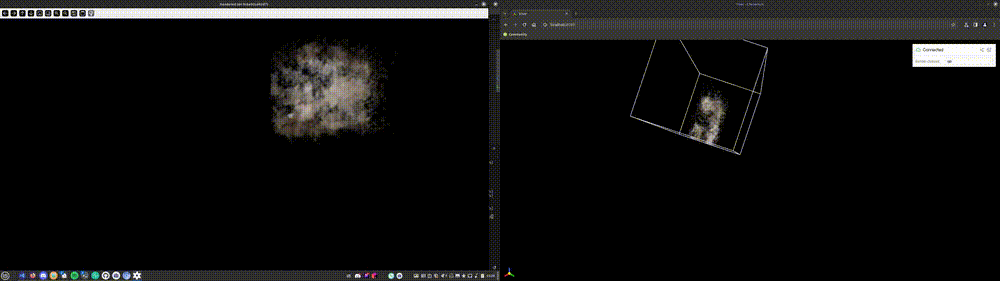

# GridGaussians



GridGaussians is a method for training large 3D Gaussian splatting models that traditionally cannot fit into GPU memory without compromising on quality. We use a grid to split the model into smaller parts, and train each part separately. During the training of each grid cell, we composite still images of other cells to simulate the full model. This allows us to train models that are orders of magnitude larger than the GPU memory. 

# 📦 Installing dependencies

## Method 1: .devcontainer

Devcontainers automatically recreate the development environment using Docker. It is mainly supported by VSCode but there is [also limited support for other editors](https://containers.dev/supporting).

Requirements:
- [Docker](https://docs.docker.com/desktop/install/linux-install/)
- [nvidia-container-toolkit](https://docs.nvidia.com/datacenter/cloud-native/container-toolkit/latest/install-guide.html) (may also available on apt)
- VSCode
- [Dev Containers extension](https://marketplace.visualstudio.com/items?itemName=ms-vscode-remote.remote-containers)

When you open the repository you should be prompted to enter the container environment. First time running might take around 5 minutes to build the environment.

## Method 2: UV Environment (Recommended - Python 3.11+)

[UV](https://github.com/astral-sh/uv) is a fast Python package manager and environment manager.

```bash
# Install uv if not already installed
curl -LsSf https://astral.sh/uv/install.sh | sh

# Clone the repository
git clone <repo-url>
cd grid-gaussians

# Sync all dependencies (creates virtual environment and installs everything)
uv sync

# Build CUDA submodules (requires torch to be installed first)
uv run python build_submodule.py ./submodules/diff-gaussian-rasterization
uv run python build_submodule.py ./submodules/simple-knn

# Add submodules to Python path
echo "$(pwd)/submodules/diff-gaussian-rasterization" > .venv/lib/python3.11/site-packages/submodules.pth
echo "$(pwd)/submodules/simple-knn" >> .venv/lib/python3.11/site-packages/submodules.pth
```

After setup, use `uv run` to run Python scripts:
```bash
uv run python grid_3dgs_demo.py
```

## Method 3: Local environment (tested on Python 3.8, Linux Mint 21.2)
`NOTE: It is recommended to use conda to manage the environment.`

- [CUDA Toolkit](https://developer.nvidia.com/cuda-downloads)
- `pip install numpy scipy torch torchvision torchaudio plyfile lpips pybind11 viser`
- Installing PyBind11 submodules
    - `pip install -e ./submodules/diff-gaussian-rasterization/`
    - `pip install -e ./submodules/simple-knn/`

# 🔗 Downloading the sample dataset
The sampling dataset is from the MIP-NeRF 360 paper. For convenience, the images are resized and zipped.
To download and extract the dataset, run `download_dataset.sh`

# 🏃‍♂️ Getting started
For an example of how to train a 3DGS model using the grid-based training loop, run the following command:
```bash
python ./grid_3dgs_demo.py
```
During training, you can visualize the model using the web-based viewer which will be started automatically. The viewer can be accessed at `http://localhost:8080`.

# 📄 Code structure
The codebase is structured as follows:
- `gs/`: The Gaussian splatting module.
    - `compositing/`: Functions for compositing images in the grid-based training loop
    - `core/`: Core data structures and functions for rendering 3DGS models
        - `View.py`: Base classes for camera views used for training 3DGS models
        - `BasePointCloud.py`: Base class for point clouds used for initializing 3DGS models
        - `GaussianModel.py`: 3DGS model refactored as a nn.Module. Use `forward` with a camera to render the model
    - `eval/`: Evaluation tools
    - `geometry/`: Geometry helpers, including bounding boxes, frustums, grids, planes.
    - `io/`: Functions for importing and exporting image and point cloud data
        - `colmap/`: Functions for importing COLMAP reconstructions into `KnownView` and `BasePointCloud` compliant objects
    - `trainers/`: Training scripts for 3DGS models
        - `basic/`: Re-implementation of the original training loop
        - `grid/`: Grid-based training loop that trains 3DGS models in parts 
    - `visualization/`: Classes for visualizing 3DGS models
        - `Viewer.py`: Class for starting a web-based 3DGS viewer for a `GaussianModel`
    - `helpers/`: General functions for rendering and training 3DGS models\

# 🫂 Credits
- [3D Gaussian splatting](https://github.com/graphdeco-inria/gaussian-splatting)
- [Modified rasterization code from ashwakey to support depth and alpha channels](https://github.com/ashawkey/diff-gaussian-rasterization)
